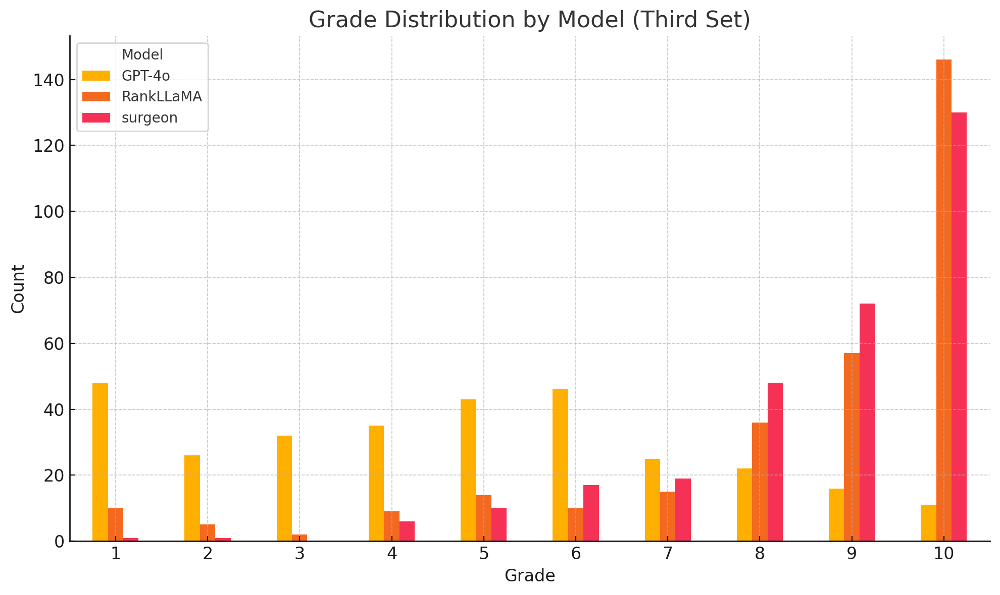
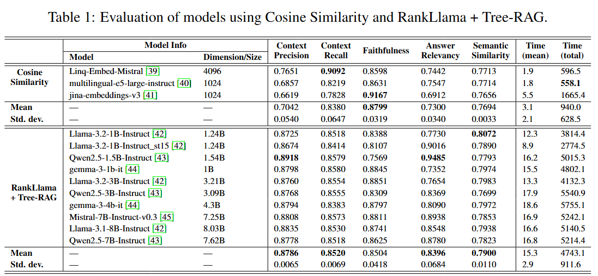
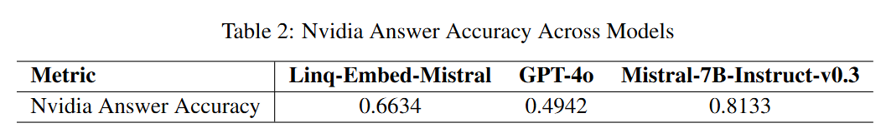

# NeurIPS_2025

This repository provides all the code used for the research: *RankLLaMA-Based Tree-RAG Using Lightweight Models for Answering Robotic-Assisted Surgery Queries*. We plan to publicly share all documents upon paper acceptance.

You may find the following documents:

- **NeurIPS_2025.xlsx**: Contains the benchmark, a subset of our dataset, and the corresponding questions from the textbook (*RAS QA Sample*, *ras_texbook_sample*), as well as the four QA sets submitted to the surgeons (original version, blind version used by the surgeons, the mapping between the two, and the grades reported in Fig. 4 of the manuscript).  
  

- **ras_qa_rag_eval.xlsx**: Contains the evaluation results for all models discussed in Table 1. A column named *retrieved content* (an array of all retrieved segments) must be removed, as the full dataset could be reconstructed from it. These tables were generated using the RAGAS framework—please refer to Subsection 4 for more details.  
  

- **ras_qa_sample**, **ras_texbook_sample**: Also included in *NeurIPS_2025.xlsx*, these are subsets of our dataset (specifically covering 3 procedures) made available to support the validity of our work.

- **tree_creation_book.py**, **RAG_NeurIPS.py**: The RankLLaMA Tree-RAG code described in Subsection 2.3. These scripts were used to generate the evaluation inputs for the RankLLaMA+TreeRAG results in Table 1 of the manuscript.

- **RAG_cos_NeurIPS.py, embedding.py**: The equivalent script for the "classic" RAG used in Table 1 (Cosine Similarity).  
  

 ## Measurement Details
In this section, we provide additional insights into the details of our measurements: 


**Table 1**: The "Var" row was created using the `=STDEV(column above)` function in Excel (Gamma3). For **Context Precision**, the reported variance reflects the variability of the metric itself, as it is model-agnostic (cf. Eq. 7, Subsection 4.1). However, for **Context Recall**, the same conclusion cannot be drawn (cf. Eq. 9, Subsection 4.1).

**Table 2**: The following precision values are reported. </pre>

## Clone Repository

```
git clone https://github.com/username/repo-name.git
cd /repo-name
```

## Fine-Tuned Models

We also provide two preliminary fine-tuned models (LLaMA-3.3-70B), trained on our benchmark (note: these models have not been evaluated): [link to the models](https://drive.google.com/drive/folders/1aC8BSQ3FIGDotzgRB_989Y48ydeiwr-T?usp=sharing)

- **qa_generator_llama3.3-70B**: A question generator that, given a chunk of text, generates a specialized question on the topic.
- **surg_qa_LLaMA-3.3-70B-Instruct**: A question-answering model that, given a RAS query, returns an appropriate answer.

The fine-tuning conditions are detailed in Subsection 4.3 *Preliminary Fine-Tuning*. 

The code was tested on the following device: One AMD EPYC 7742 64-Core Processor 8 Nvidia-A100 (40 GB).

## Code Sections

Please check each directory:

- [RAG](RAG/): Codes to run the conventional RAG and our RankLLaMA+Tree-RAG through the surgeon Query-Answer (QA).
- [RAG Evaluation](eval/): Codes to evaluate the answers generated from each model using either the conventional RAG or our RankLLaMA+Tree-RAG.
- [Query Generation](query_gen/): Codes to fine-tune a model and generate queries for robotic-assisted surgeries (Preliminary future work).
